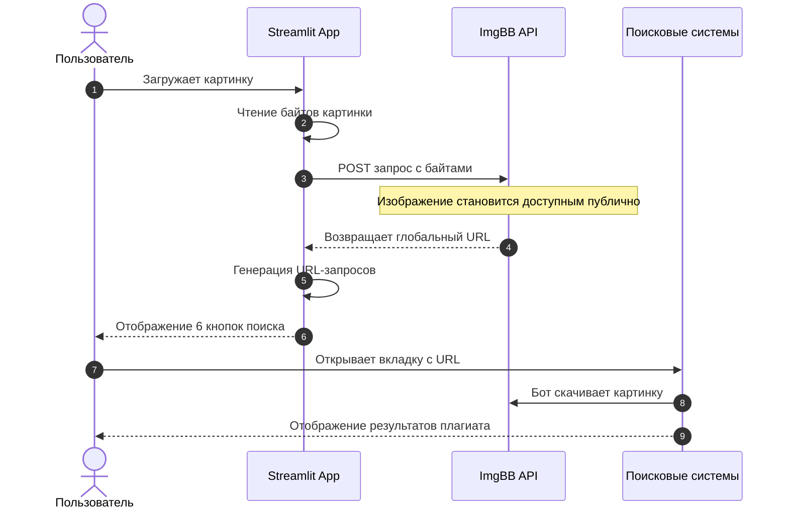
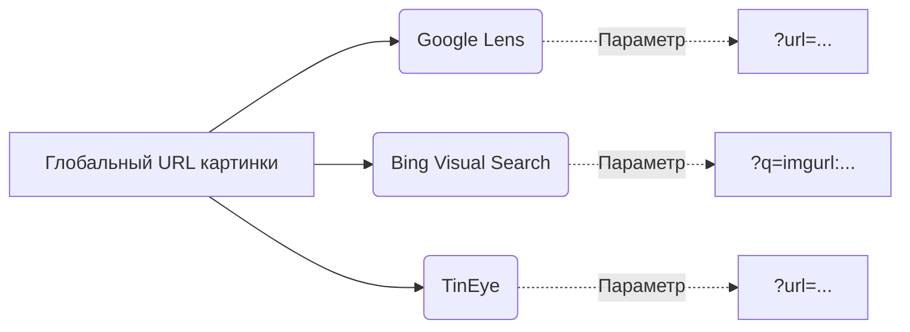
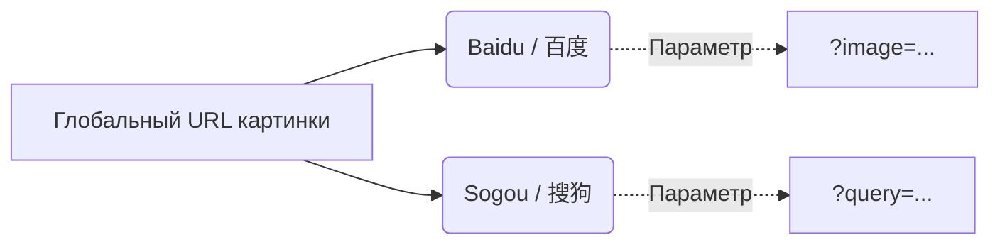
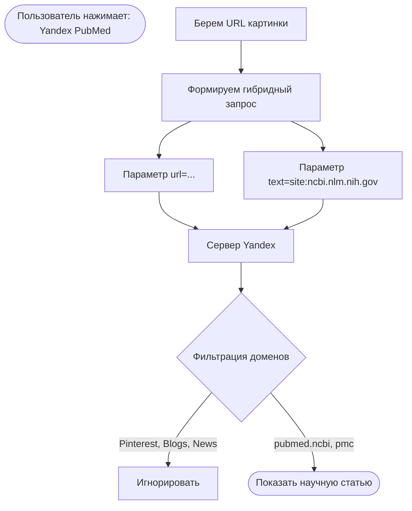

# Архитектура сервиса реверсивного поиска изображений

В этом документе подробно описана техническая реализация и архитектура работы нашего MVP для реверсивного поиска медицинских изображений. 

---

## 1. Общая схема (Пайплайн данных)

Главная архитектурная проблема поиска изображений в интернете — поисковые боты (особенно китайские) не могут получать файлы напрямую с вашего локального компьютера. Поэтому мы используем промежуточный узел (CDN) для временного хостинга.

---

## 2. Специфика интеграции с разными ресурсами

Мы используем метод **URL Parameters Injection**. Вместо того чтобы использовать тяжелые браузерные движки (Selenium) или платные API, мы генерируем готовые GET-запросы, которые поисковики воспринимают как команду к действию.

### Глобальные поисковики (Западный сегмент)

* **Google Lens:** Использует эндпоинт `uploadbyurl`. Это самый современный движок Google. 
* **Bing:** Использует классический движок `detailv2&iss=sbi`, где ссылка на изображение передается как часть текстового запроса `q=imgurl:{url}`.
* **TinEye:** Классический поиск плагиата, принимает параметр напрямую.

### Китайские поисковики (Азиатский сегмент)

Азиатский сегмент закрыт "Великим китайским файрволом". Мы используем **ImgBB**, так как его домены внесены в белые списки маршрутизации Китая. Если бы мы использовали анонимные хостинги (вроде `catbox.moe`), запросы обрывались бы по таймауту.

* **Baidu:** Используется их скрытый графовый API `graph.baidu.com/details`.
* **Sogou:** Работает через мобильно-десктопный эндпоинт `pic.sogou.com/ris`.

---

## 3. Схема "Научного поиска" (Фильтрация по PubMed)

Поиск научных статей требует сужения области видимости поисковика. Так как прямые медицинские API (например, Open-i от NIH) часто падают под нагрузкой или запрещают программную загрузку (возвращают HTML-ошибки вместо JSON), мы применили гибридный подход.

* **Суть метода:** Мы заставляем Яндекс использовать свой мощный движок визуального поиска (`rpt=imageview`), но при этом принудительно добавляем текстовый фильтр (`text=site:ncbi.nlm.nih.gov`).
* **Результат:** Яндекс сканирует визуальные совпадения, но на этапе выдачи отбрасывает всё, что не принадлежит медицинской базе PubMed Central.
